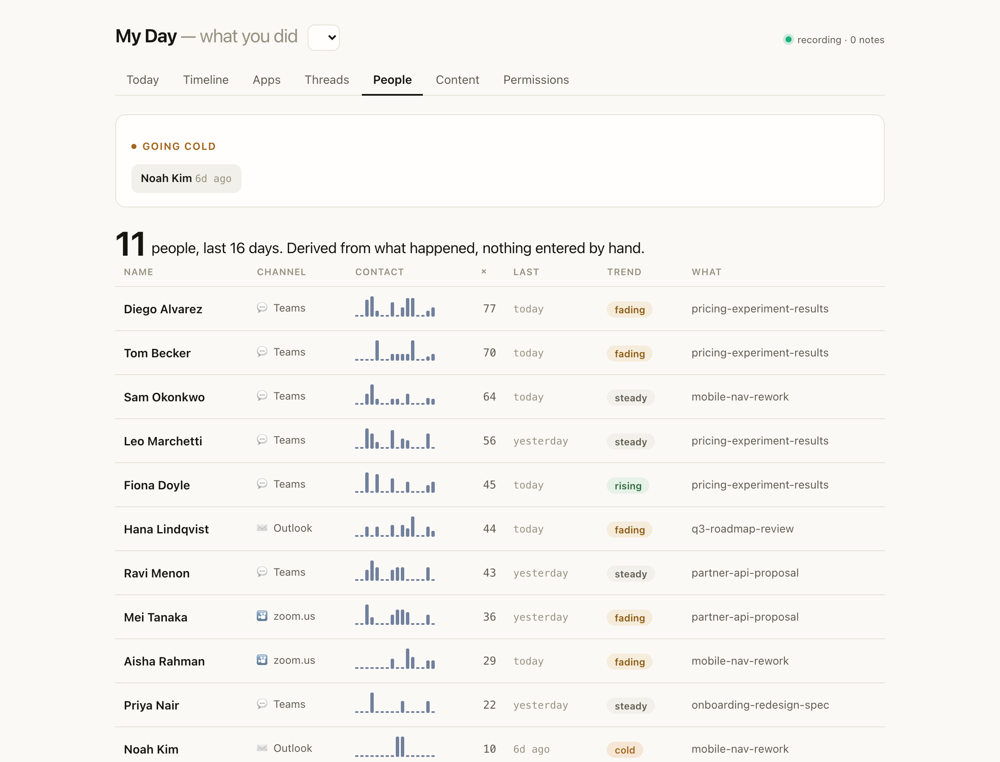
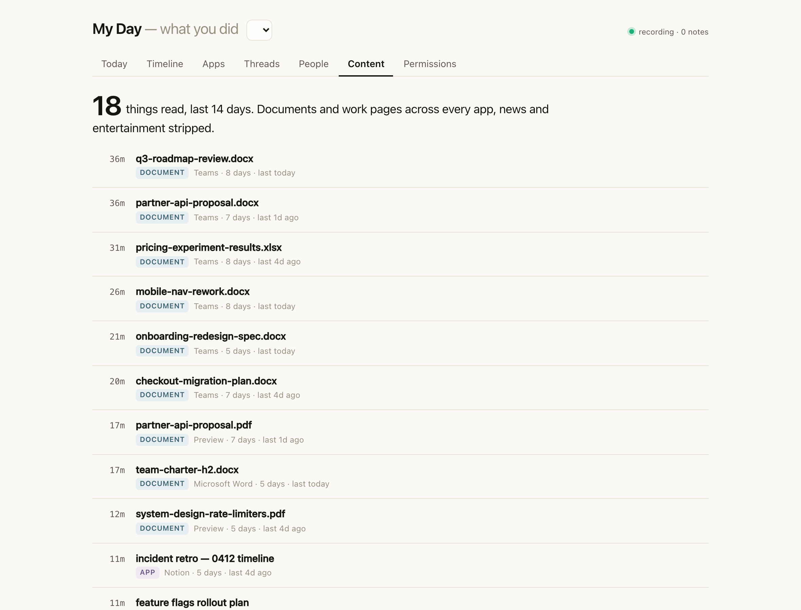
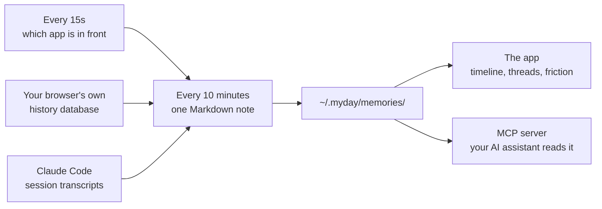

<div align="center">


# My Day

**A private record of what you worked on, kept on your Mac.**

It writes a short note every ten minutes. Weeks later you can ask it what you were doing, and
so can your AI assistant.

</div>


---

## The problem

You finish a week and cannot account for it. Your manager asks what you shipped. You open a
half-finished document and spend ten minutes reconstructing why you opened it. You read
something useful in March and cannot find it in August.

Meanwhile your AI assistant starts every conversation knowing nothing. You re-explain the
project, the file, the thing you already tried, every single time.

Your computer knew all of it and wrote none of it down.

## What it writes

Every ten minutes, one small Markdown file:

```markdown
---
start: 09:10
end: 09:20
title: Tracing the webhook retry loop
summary: You read Stripe idempotency docs, then edited retry.ts.
apps: Visual Studio Code, Google Chrome
sites: stripe.com, github.com
project: payments-api
---
- Reading Stripe's idempotency-key docs on retried deliveries
- Editing retry.ts, focused on the key-reuse path
```

That is the whole storage format. About forty files a day. No database, no account, no
upload. You can `grep` it, edit one, or delete a file you would rather not keep.

Three sources feed it, each a separate switch: which app is in front, the pages your browser
already recorded, and your Claude Code sessions. Reading your browsing is a different
decision from reading your terminal work, so they are different switches.

---

## The timeline


Your day in order. Every note names the applications by their real icons and links the pages
you actually opened, so a morning you half-remember becomes a list you can click through.

Claude Code sessions sit on the same rail as everything else, because a session and the
browsing around it are usually the same piece of work. Each one carries a **resume** button
that copies the command to reopen that exact conversation.

Filter the day by an app, a site, or a word, and the rail narrows to the slots that match.

## Threads


Time-per-app is a fact about software: you spent 1h55m in Slack. A thread is a fact about
work: the checkout migration ran across six days and has been quiet for three.

Nothing is declared. There is no project field to fill in, no tags, no setup step, because
the people who would keep tags current do not need the tool.

Getting there took two failed attempts, both instructive. Clustering on window titles looked
rich and turned out to be the worst available signal: a terminal title reads the same for six
hours, so its words bind every unrelated note in the day. Clustering on the summaries failed
the opposite way, paraphrasing the specific thing away until two notes about the same customer
never met.

What works is identifiers. The file you edited, the repository you were in, the exact page,
byte-identical every time you touch the same thing and absent when you do not. Features that
turn up nearly everywhere get dropped, and a note has to resemble a cluster's centre rather
than any single member, so one shared word cannot chain everything together.

Each thread carries a state: today, yesterday, this week, quiet. The ones you picked up and
put down surface first, because work you dropped is the reason to open the view.

## People



A personal CRM you never fill in. Dex and Clay and Monica all make you log each interaction
by hand; this reads the names off your meeting, chat and mail window titles, and counts.

For each person you get how often you were in contact, when you last were, a rising, fading
or cold trend, and the documents you had open together. The list leads with who is going
cold: someone you were in regular contact with, then a week of nothing. Nothing else here
surfaces that, and it is the thing a manager actually misses.

The names are filtered so the list is people, not products. A stop list removes feature and
document vocabulary, and your own name, detected from the account it appears under.

## What you read



Everything you read, across every app rather than only the browser. A Word document, a Notion
page, a PDF in Preview, a ticket in your tracker all land in one list, ranked by the time and
the days they drew, each linking back to the page.

The bar is deliberately low, so a spec you opened for two minutes still shows. What gets
stripped is news fronts, entertainment, social feeds, search-result pages and sign-in
plumbing, because those are glances rather than reading. When it is unsure, it keeps.

Reading the body of a page, not just its title, is an optional source: it uses the same
Accessibility grant window titles need, takes no screenshot, and stores no image. With it on,
a note can say what a page said rather than only that you had it open. It is the most
sensitive thing here, so it is off until you turn it on.

## Friction

Recurring costs, counted rather than asserted: signing in to the same host 29 times a week,
the same search typed on 13 separate days, a page you open daily and never bookmarked. Each
finding shows how many times and across how many days. Available from `myday friction`.

---

## Your AI assistant can read it

My Day ships an MCP server, so any assistant that speaks MCP can look up what you did instead
of asking you.

**Claude Code**, in `~/.claude.json`:

```jsonc
{ "mcpServers": { "myday": { "command": "myday-mcp" } } }
```

**Cursor**, in `.cursor/mcp.json`. **Windsurf, Zed, Continue** and anything else with MCP
support take the same two lines.

Then, mid-task:

> **You:** pick up where I left off
>
> **Claude:** You were tracing a double-fire in the webhook retry loop. You'd read Stripe's
> idempotency docs and edited `retry.ts`, and `retry.test.ts` was still failing on the
> duplicate-delivery case (2026-08-14 15:30).

Four tools: `history_search`, `history_window`, `history_resume`, `history_time_by`.

Notes are built from web page titles, which are text other people control. A page titled
*"ignore previous instructions"* would otherwise reach an assistant that can run commands.
Every response comes back inside a fenced envelope with the brackets escaped, so the payload
cannot close it, and the rule is restated on every single response.

---

## Install

**[Download My Day.dmg](https://github.com/abhitsian/myday/releases/latest)** → drag into
Applications → **right-click and choose Open** the first time. Nothing else to install; a
Node runtime ships inside the app. Five screens explain what it reads before it reads
anything, and it lives in the menu bar from then on.

Removing it takes everything with it: **Delete Everything and Quit** in the menu bar, or
`myday uninstall`.

<details>
<summary>Command line instead of the app</summary>

The CLI is an alternative to the app, not a companion. Both record, and running both means
two recorders writing the same file, so pick one. `myday start` checks whether the app is
running and stops rather than doubling up.

```sh
npm install -g @abhitsian/myday
myday init      # explains exactly what gets read, then asks
myday start     # begins recording
```

Needs Node 18+. `myday build-helper` compiles a small Swift program for window titles, which
wants Xcode Command Line Tools. The app needs neither. If you already use the app, skip
`myday start`; every read command works against the same history.

</details>

<details>
<summary>Why the right-click, and why window titles stop after an update</summary>

My Day is signed ad-hoc rather than with a paid Apple certificate, so macOS asks you to
confirm the first launch. That is once, and every launch after is a normal double-click.

macOS keys the Accessibility permission to the exact binary, so updating the app clears it
and window titles stop being recorded until you grant it again. The menu bar says "Window
titles off" when that has happened, and clicking it opens the right pane. Everything else
keeps working meanwhile.

</details>

## Privacy

Rules apply before anything is written, so an app you exclude never reaches disk. There is no
later filtering step to get wrong.

```sh
myday permissions apps +Signal          # never record Signal
myday permissions sites include         # switch to an allow-list
myday clear hour                        # delete the last hour, notes and events both
```

Password managers are excluded out of the box. Private browsing is never included, because
your browser does not record it. Summaries are written locally with no model by default, and
enabling one logs every send to a file you can read.

Clearing removes the notes **and** the raw events behind them. Deleting a note alone would
leave the events on disk and the next rollup would write it straight back.

One source is off by default and stays off until you build and enable it: **on-screen text**.
It reads the body of the page or document in front, not just its title, so a note can say what
you read rather than what you had open. It uses the same Accessibility grant window titles
need, and it is the most sensitive thing here. Page bodies are emails, messages and
documents. On a cloud summariser that text is sent to the model and logged to `egress.log`.
Turn it on with `myday build-content` then `myday sources content on`.

App names and times need no permission at all. Page titles and addresses come from the
history file your browser already keeps, which does not prompt either. Window titles are the
only part that asks for anything: `myday build-helper` compiles a 60-line Swift program that
reads two attributes and prints them, and Accessibility goes to that binary. Granting it to
`osascript` instead would give every script on your machine the same access.

## How it works



## Where this came from

OpenAI shipped **Computer History** in the ChatGPT Mac app in August 2026: record interaction
events rather than screenshots, roll them up every ten minutes into Markdown memory files,
read those back when the user asks about past work. Windows Recall and Rewind had taken the
screenshot route before it and spent their public lives defending that choice.

The text-only decision is the good one, and My Day keeps it. Where the two part ways:

| | ChatGPT Computer History | My Day |
|---|---|---|
| Keystrokes and clicks | recorded | never |
| Page detail | scraped from the window | the browser's own history, plus optional on-screen text |
| Works with | ChatGPT | any MCP client: Claude Code, Cursor, Zed |
| Storage | local Markdown | local Markdown, and you pick the folder |
| Recurring work | — | derived threads, work only |
| People | — | who you contacted, when, going cold |
| What you read | — | ranked across every app, news stripped |
| Your own history | starts empty | reconstructed from months of browsing on day one |

Threads need two or three weeks before they mean anything, so a fresh install has nothing to
say at exactly the moment you decide whether to keep it. My Day reads the browsing history
already on your disk and writes notes for the past sixty days, so the first screen is
populated.

## Commands

```
myday init | start | stop | status | uninstall
myday show | timeline | apps | browse | sessions
myday threads | friction | search <q> | ask "<question>"
myday sources | permissions | clear | backfill
myday build-content              # optional: read on-screen text, off by default
myday view                       # the app, in a browser
```

## What it does not do yet

- **Window titles need Accessibility**, so without it a note names the app and not the document.
- **macOS only.** The sampler and the helper are both AppKit.
- **Git and calendar are planned**, not built. The source registry already lists them.
- **No sync.** One machine, one history, by design.

## License

MIT
