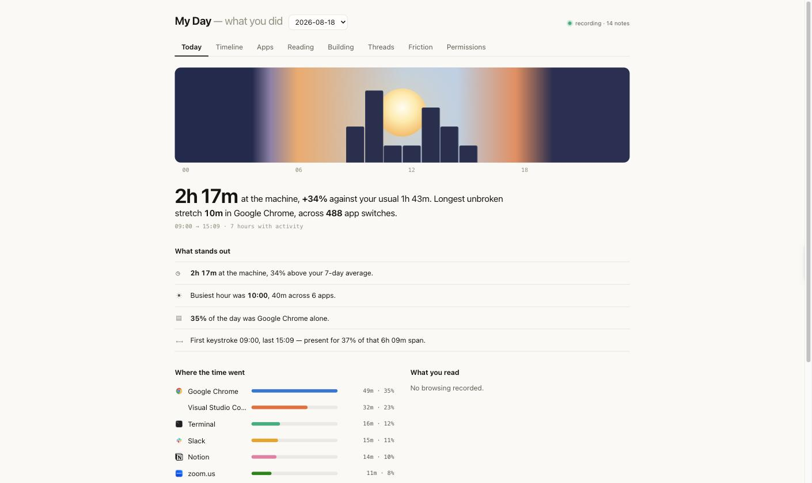
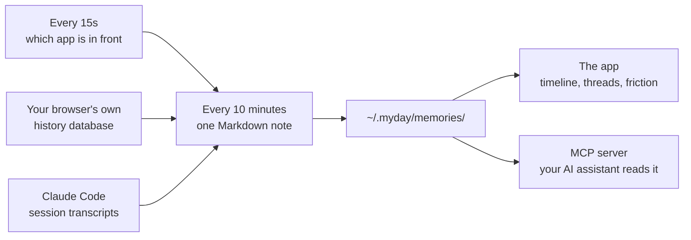
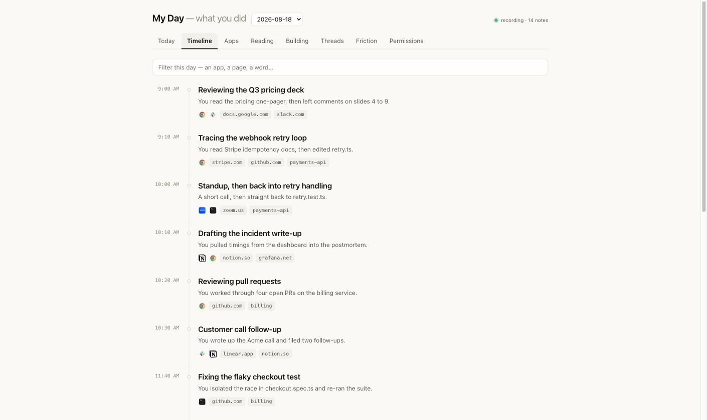
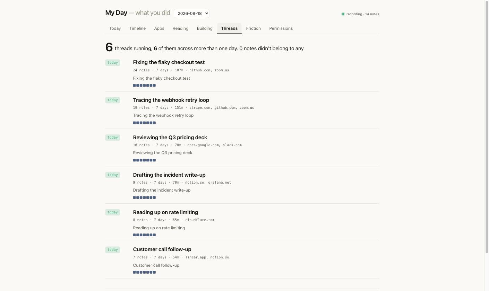

<div align="center">


# My Day

**A private record of what you worked on, kept on your Mac.**

It writes a short note every ten minutes. Weeks later you can ask it what you were doing —
and so can your AI assistant.

</div>



---

## The problem

You finish a week and cannot account for it. Your manager asks what you shipped. You open a
half-finished document and spend ten minutes reconstructing why you opened it. You read
something useful in March and cannot find it in August.

Meanwhile your AI assistant starts every conversation knowing nothing. You re-explain the
project, the file, the thing you already tried, every single time.

Your computer knew all of it and wrote none of it down.

## What My Day does

Every ten minutes it writes one small Markdown file describing what you were doing:

```markdown
---
start: 09:10
end: 09:20
title: Tracing the webhook retry loop
summary: You read Stripe idempotency docs, then edited retry.ts.
apps: Visual Studio Code, Google Chrome
sites: stripe.com, github.com
project: payments-api
---
- Reading Stripe's idempotency-key docs on retried deliveries
- Editing retry.ts, focused on the key-reuse path
```

That is the whole storage format. No database, no account, no upload. You can `grep` it,
edit it, or delete a file you would rather not keep.

## Install

**[Download My Day.dmg](https://github.com/abhitsian/myday/releases/latest)** → drag it into
Applications → **right-click the app and choose Open** the first time.

That right-click is needed exactly once. My Day is signed ad-hoc rather than with a paid
Apple certificate, so macOS asks you to confirm the first launch. Everything after that is a
normal double-click. Nothing else to install — a Node runtime ships inside the app.

Five screens walk you through what it reads before it reads anything, and it lives in the menu
bar from then on.

One consequence of the ad-hoc signature: macOS keys the Accessibility permission to the exact
binary, so **updating the app clears it** and window titles stop being recorded until you grant
it again. The menu bar says "Window titles off" when that has happened, and clicking it opens
the right settings pane. Everything else keeps working meanwhile — app names and times need no
permission at all.

<details>
<summary>Prefer the command line?</summary>

The CLI is an alternative to the app, not a companion to it. Both record, and running both
means two recorders writing the same file, so pick one. `myday start` checks whether the app is
running and stops rather than doubling up.

```sh
npm install -g @abhitsian/myday
myday init      # explains exactly what gets read, then asks
myday start     # begins recording
```

The CLI needs Node 18+, and `myday build-helper` compiles a small Swift program for window
titles (that step wants Xcode Command Line Tools). The app needs neither.

If you already use the app, skip `myday start` — every read command works against the same
history either way.

</details>

Removing it takes everything with it — "Delete Everything and Quit" in the menu bar, or
`myday uninstall`. Both remove every note, every raw event, and the settings; the app itself
goes to the Trash the usual way.

## How it works



Three sources feed it, and you switch each one on or off separately. Reading your browsing
is a different decision from reading your terminal work, so they are different switches.

### It works before you grant it anything

| Tier | Needs | You get |
|------|-------|---------|
| 1 | nothing at all | Which app was in front, and for how long |
| 2 | nothing at all | Page titles and addresses, from your browser's own history |
| 3 | Accessibility, one small binary | Window titles — the document, the chat, the folder |

Most tools in this category want an invasive permission before they show you anything, so
you have to trust them on a promise. Run tiers 1 and 2 for a week and read the output first.

For tier 3, `myday build-helper` compiles a 60-line Swift program that reads two attributes
and prints them. You grant Accessibility to that one binary rather than to `osascript`,
which would hand the same power to every script on your machine.

---

## The timeline



Your day in order, with real application icons and clickable page links. Claude Code sessions
sit on the same rail, each with a **resume** button that copies the command to reopen it.

## Threads



A tracker tells you that you spent 1h55m in Slack, which is a fact about software. Threads
tell you the checkout bug ran across four days and has been quiet since Tuesday, which is a
fact about your work.

Nothing is declared. There is no project field to fill in — threads are derived from the
files you touched and the pages you opened. Each carries a state (today, yesterday, this
week, quiet), and the ones you picked up and put down surface first.

## Friction

The costs your day hides from you, each with the evidence attached:

- Signing in to the same host 29 times a week, which is a session-timeout setting rather than a habit
- The same search typed on 13 separate days, because the answer never got saved anywhere
- A page you navigate to most days and never bookmarked

---

## Your AI assistant can read it

This is the part that changes how the tool feels. My Day ships an MCP server, so any
assistant that speaks MCP can look up what you did without you re-explaining it.

**Claude Code** — add to `~/.claude.json`:

```jsonc
{ "mcpServers": { "myday": { "command": "myday-mcp" } } }
```

**Cursor** — add to `.cursor/mcp.json`. **Windsurf, Zed, Continue** and anything else with
MCP support take the same two lines.

Then, mid-task:

> **You:** pick up where I left off
>
> **Claude:** You were tracing a double-fire in the webhook retry loop — you'd read Stripe's
> idempotency docs and edited `retry.ts`, and `retry.test.ts` was still failing on the
> duplicate-delivery case (2026-08-14 15:30).

Four tools are exposed: `history_search`, `history_window`, `history_resume`, and
`history_time_by`.

Notes are built from web page titles and window titles, which are text other people control.
A page titled *"ignore previous instructions"* would otherwise reach an assistant that can
run commands. Every response comes back inside a fenced envelope with the brackets escaped,
so the payload cannot break out of it, and the rule is restated on every single response.

---

## Where this came from

OpenAI shipped **Computer History** in the ChatGPT Mac app in August 2026: record interaction
events rather than screenshots, roll them up every ten minutes into Markdown memory files,
read those back when the user asks about past work. Windows Recall and Rewind had taken the
screenshot route before it and spent their public lives defending that choice.

The text-only decision is the good one, and My Day keeps it. Where the two part ways:

| | ChatGPT Computer History | My Day |
|---|---|---|
| Before you grant anything | nothing | app names, then full browsing detail |
| Page detail | scraped from the window | read from the browser's own history |
| Works with | ChatGPT | any MCP client — Claude Code, Cursor, Zed |
| Storage | local Markdown | local Markdown, and you pick the folder |
| Recurring work | — | derived threads with a state per thread |
| Recurring costs | — | friction, with the evidence attached |
| Your own history | starts empty | reconstructed from months of browsing on day one |

That last row matters more than it sounds. Threads need two or three weeks before they mean
anything, so a fresh install has nothing to say at exactly the moment you decide whether to
keep it. My Day reads the browsing history already on your disk and writes notes for the past
sixty days, so the first screen you see is populated.

## Privacy

Rules apply before anything is written, so an app you exclude never reaches disk. There is no
later filtering step to get wrong.

```sh
myday permissions apps +Signal          # never record Signal
myday permissions sites include         # switch to an allow-list
myday clear hour                        # delete the last hour, notes and events both
```

Password managers are excluded out of the box. Private browsing is never included, because
your browser does not record it. Summaries are written locally with no model by default, and
enabling one logs every send to a file you can read.

Clearing removes the notes **and** the raw events behind them. Deleting a note alone would
leave the events on disk and the next rollup would write it straight back.

## Commands

```
myday init | start | stop | status | uninstall
myday show | timeline | apps | browse | sessions
myday threads | friction | search <q> | ask "<question>"
myday sources | permissions | clear | backfill
myday view                       # the app, in a browser
```

## What it does not do yet

- **Window titles need a permission**, so without tier 3 a note names the app and not the document.
- **Threads bind 41% of consecutive notes.** Continuous work still fragments more than it should.
- **Nothing pushes.** Every view waits for you to open it.
- **macOS only.** The capture layer is Cocoa and LaunchServices.

MIT licensed. Built by [Abhishek Sivaraman](https://github.com/abhitsian).
